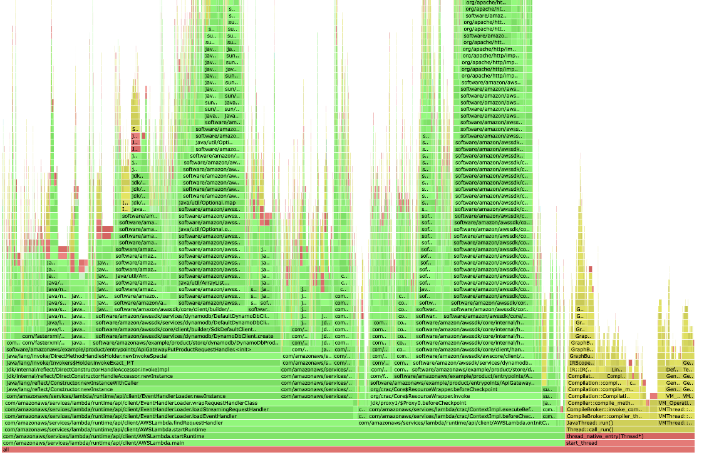

# AWS Lambda Java Support Libraries
Key libraries for running Java on the AWS Lambda platform.

For issues and questions, you can start with our [FAQ](https://aws.amazon.com/lambda/faqs/)
and the AWS questions and answer site [re:Post](https://repost.aws/tags/TA5uNafDy2TpGNjidWLMSxDw/aws-lambda)

To get started writing Lambda functions in Java, check out the official [developer guide](https://docs.aws.amazon.com/lambda/latest/dg/lambda-java.html).

For information on how to optimize your functions watch the re:Invent talk [Optimize your Java application on AWS Lambda](https://www.youtube.com/watch?v=sVJOJUD0fhQ).

## Core Java Lambda interfaces - aws-lambda-java-core

[](https://central.sonatype.com/artifact/com.amazonaws/aws-lambda-java-core)

This package defines the Lambda [Context](http://docs.aws.amazon.com/lambda/latest/dg/java-context-object.html) object
as well as [interfaces](http://docs.aws.amazon.com/lambda/latest/dg/java-handler-using-predefined-interfaces.html) that Lambda accepts.

- [Release Notes](aws-lambda-java-core/RELEASE.CHANGELOG.md)

Example request handler

```java
public class Handler implements RequestHandler<Map<String, String>, String>{
 @Override
 public String handleRequest(Map<String, String> event, Context context) {

 }
}
```

Example request stream handler

```java
public class HandlerStream implements RequestStreamHandler {
  @Override
  public void handleRequest(InputStream inputStream, OutputStream outputStream, Context context) throws IOException {

  }
}
```

```xml
<dependency>
 <groupId>com.amazonaws</groupId>
 <artifactId>aws-lambda-java-core</artifactId>
 <version>1.3.0</version>
</dependency>
```

## Java objects of Lambda event sources - aws-lambda-java-events

[](https://central.sonatype.com/artifact/com.amazonaws/aws-lambda-java-events)

This package defines [event sources](http://docs.aws.amazon.com/lambda/latest/dg/intro-invocation-modes.html) that Lambda natively accepts.
See the [documentation](aws-lambda-java-events/README.md) for a list of currently supported event sources.
Using this library you can have Java objects which represent event sources.

For example an SQS event:

```java
import com.amazonaws.services.lambda.runtime.events.SQSEvent;

public class SqsHandler implements RequestHandler<SQSEvent, String> {

 @Override
 public String handleRequest(SQSEvent event, Context context) {

 }
}
```

- [Release Notes](aws-lambda-java-events/RELEASE.CHANGELOG.md)

```xml
<dependency>
 <groupId>com.amazonaws</groupId>
 <artifactId>aws-lambda-java-events</artifactId>
 <version>3.15.0</version>
</dependency>
```

## Java Lambda JUnit Support - aws-lambda-java-tests

[](https://central.sonatype.com/artifact/com.amazonaws/aws-lambda-java-tests)

This package provides utils to ease Lambda Java testing. It uses the same Lambda serialisation logic and `aws-lambda-java-events` to inject events in your JUnit tests.

- [Release Notes](aws-lambda-java-tests/RELEASE.CHANGELOG.md)

```java
@ParameterizedTest
@Event(value = "sqs/sqs_event.json", type = SQSEvent.class)
public void testInjectSQSEvent(SQSEvent event) {
        ...
}
```

```xml
<dependency>
  <groupId>com.amazonaws</groupId>
  <artifactId>aws-lambda-java-tests</artifactId>
  <version>1.1.1</version>
  <scope>test</scope>
</dependency>
```

## aws-lambda-java-events-sdk-transformer

[](https://central.sonatype.com/artifact/com.amazonaws/aws-lambda-java-events-sdk-transformer)

This package provides helper classes/methods to use alongside `aws-lambda-java-events` in order to transform
Lambda input event model objects into SDK-compatible output model objects.
See the [documentation](aws-lambda-java-events-sdk-transformer/README.md) for more information.

- [Release Notes](aws-lambda-java-events-sdk-transformer/RELEASE.CHANGELOG.md)

```xml
<dependency>
 <groupId>com.amazonaws</groupId>
 <artifactId>aws-lambda-java-events-sdk-transformer</artifactId>
 <version>3.1.0</version>
</dependency>
```

## Java Lambda Log4J2 support - aws-lambda-java-log4j2

[](https://central.sonatype.com/artifact/com.amazonaws/aws-lambda-java-log4j2)

This package defines the Lambda adapter to use with Log4J version 2.
See the [README](aws-lambda-java-log4j2/README.md) or the [official documentation](http://docs.aws.amazon.com/lambda/latest/dg/java-logging.html#java-wt-logging-using-log4j) for information on how to use the adapter.

- [Release Notes](aws-lambda-java-log4j2/RELEASE.CHANGELOG.md)

```xml
<dependency>
 <groupId>com.amazonaws</groupId>
 <artifactId>aws-lambda-java-log4j2</artifactId>
 <version>1.6.0</version>
</dependency>
```

## Lambda Profiler Extension for Java - aws-lambda-java-profiler

<p align="center">
    
</p>

This project allows you to profile your Java functions invoke by invoke, with high fidelity, and no code changes. It 
uses the [async-profiler](https://github.com/async-profiler/async-profiler) project to produce profiling data and 
automatically uploads the data as flame graphs to S3.

Follow our [Quick Start](experimental/aws-lambda-java-profiler#quick-start) to profile your functions.

## Java implementation of the Runtime Interface Client API - aws-lambda-java-runtime-interface-client
[](https://central.sonatype.com/artifact/com.amazonaws/aws-lambda-java-runtime-interface-client)

This package defines the Lambda Java Runtime Interface Client package, a Lambda Runtime component that starts the runtime and interacts with the Runtime API - i.e., it calls the API for invocation events, starts the function code, calls the API to return the response.
The purpose of this package is to allow developers to deploy their applications in Lambda under the form of Container Images. See the [README](aws-lambda-java-runtime-interface-client/README.md) for information on how to use the library.

- [Release Notes](aws-lambda-java-runtime-interface-client/RELEASE.CHANGELOG.md)

```xml
<dependency>
 <groupId>com.amazonaws</groupId>
 <artifactId>aws-lambda-java-runtime-interface-client</artifactId>
 <version>2.6.0</version>
</dependency>
```

## Java Lambda provided serialization support - aws-lambda-java-serialization

[](https://central.sonatype.com/artifact/com.amazonaws/aws-lambda-java-serialization)

This package defines the Lambda serialization logic using in the `aws-lambda-java-runtime-client` library. It has no current standalone usage.

- [Release Notes](aws-lambda-java-serialization/RELEASE.CHANGELOG.md)

```xml
<dependency>
 <groupId>com.amazonaws</groupId>
 <artifactId>aws-lambda-java-serialization</artifactId>
 <version>1.1.5</version>
</dependency>
```

## Disclaimer of use

Each of the supplied packages should be used without modification. Removing
dependencies, adding conflicting dependencies, or selectively including classes
from the packages can result in unexpected behavior.
