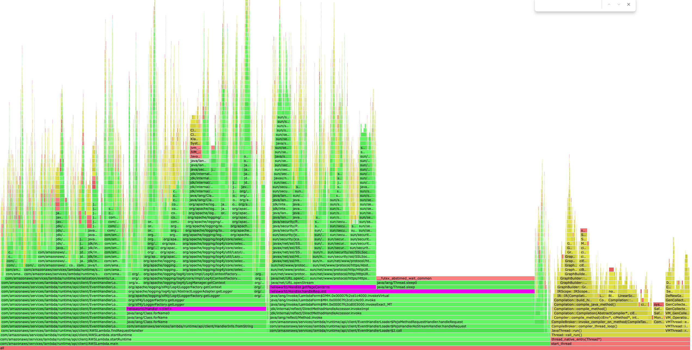

<p align="center">
    
</p>

<h2 align="center">AWS Lambda Profiler Extension for Java</h2>

The Lambda profiler extension allows you to profile your Java functions invoke by invoke, with high fidelity, and no 
code changes. It uses the [async-profiler](https://github.com/async-profiler/async-profiler) project to produce 
profiling data and automatically uploads the data as flame graphs to S3.

<p align="center">
    
</p>

This is an alpha release and not yet ready for production use. We're especially interested in early feedback on features, performance, and compatibility. Please send feedback by opening a [GitHub issue](https://github.com/aws/aws-lambda-java-libs/issues/new).

### Usage

To use the profiler you need to 

1. Build the extension in this repo
2. Deploy it as a Lambda Layer
3. Create an S3 bucket for the results, or reuse an existing one
4. Give your function permission to write to the bucket
5. Configure the required environment variables.

The following [Quick Start](#quick-start) will give you AWS CLI commands to run to get started. There are also [examples](examples) 
using infrastructure as code for you to refer to.

### Quick Start 

- Clone the repo

```bash
git clone https://github.com/aws/aws-lambda-java-libs
```

- Build the extension

```bash
cd aws-lambda-java-profiler/extension
./build_layer.sh
```

- Run the `update-function.sh` script which will create a new S3 bucket, Lambda layer and all the configuration required.

```bash
cd ..
./update-function.sh YOUR_FUNCTION_NAME
```

### Configuration 

#### Required Environment Variables

| Name                         | Value                                                                                         | 
|------------------------------|-----------------------------------------------------------------------------------------------|
| PROFILER_RESULTS_BUCKET_NAME | Your unique bucket name                                                                       | 
| JAVA_TOOL_OPTIONS            | -XX:+UnlockDiagnosticVMOptions -XX:+DebugNonSafepoints -javaagent:/opt/profiler-extension.jar |

#### Optional Environment Variables

| Name                          | Default Value                                             | Options                        |
|-------------------------------|-----------------------------------------------------------|--------------------------------|
| PROFILER_START_COMMAND        | start,event=wall,interval=1us                             |                                |
| PROFILER_STOP_COMMAND         | stop,file=%s,include=*AWSLambda.main,include=start_thread | file=%s is required            |
| PROFILER_DEBUG                | false                                                     | true - to enable debug logging |
| PROFILER_COMMUNICATION_PORT   | 1234                                                      | a valid port number            |

### How does it work?

In `/src` is the code for a Java agent. It's entry point `AgentEntry.premain()` is executed as the runtime starts up.
The environment variable `JAVA_TOOL_OPTIONS` is used to specify which .jar file the agent is in. The `MANIFEST.MF` file
is used to specify the pre-main class.

When the agent is constructed, it starts the profiler and registers itself as a Lambda extension for `INVOKE` request.

A new thread is created to handle calling `/next` and uploading the results of the profiler to S3. The bucket to upload
the result to is configurable using an environment variable.

### Troubleshooting

- Ensure the Lambda function has the necessary permissions to write to the S3 bucket.
- Verify that the environment variables are correctly set in your Lambda function configuration.
- Check CloudWatch logs for any error messages from the extension.

### Contributing

Contributions to improve the extension are welcome. Please submit pull requests with your proposed changes.
