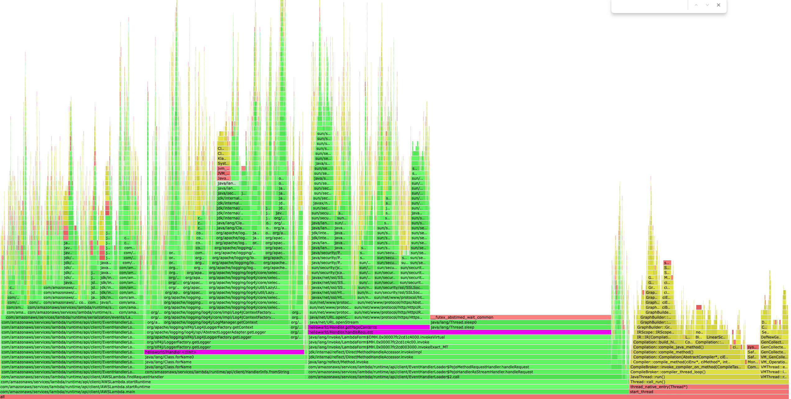

<p align="center">
    
</p>

<h2 align="center">AWS Lambda Profiler Extension for Java</h2>

The Lambda profiler extension allows you to profile your Java functions invoke by invoke, with high fidelity, and no 
code changes. It uses the [async-profiler](https://github.com/async-profiler/async-profiler) project to produce 
profiling data and automatically uploads the data as HTML flame graphs to S3.

<p align="center">
    
</p>

## Current status
**This is an alpha release and not yet ready for production use.** We're especially interested in early feedback on usability, features, performance, and compatibility. Please send feedback by opening a [GitHub issue](https://github.com/aws/aws-lambda-java-libs/issues/new).

The profiler has been tested with Lambda managed runtimes for Java 17 and Java 21.

## How to use the Lambda Profiler

To use the profiler you need to 

1. Build the extension in this repo
2. Deploy it as a Lambda Layer and attach the layer to your function
3. Create an S3 bucket for the results, or reuse an existing one
4. Give your function permission to write to the bucket
5. Configure the required environment variables.

The above assumes you're using the ZIP deployment method with managed runtimes. If you deploy your functions as container images instead, you will need to include the profiler in your Dockerfile at `/opt/extensions/` rather than using a Lambda layer.

### Quick Start 

The following [Quick Start](#quick-start) gives AWS CLI commands you can run to get started (MacOS/Linux). There are also [examples](examples) using infrastructure as code for you to refer to.

1. Clone the repo

   ```bash
   git clone https://github.com/aws/aws-lambda-java-libs
   ```

2. Build the extension

   ```bash
   cd aws-lambda-java-libs/experimental/aws-lambda-java-profiler/extension
   ./build_layer.sh
   ```

3. Run the `update-function.sh` script which will create a new S3 bucket, Lambda layer and all the configuration required.

   ```bash
   cd ..
   ./update-function.sh YOUR_FUNCTION_NAME
   ```

4. Invoke your function and review the flame graph in S3 using your browser.

### Configuration 

#### Required Environment Variables

| Name                                    | Value                                                                                         | 
|-----------------------------------------|-----------------------------------------------------------------------------------------------|
| AWS_LAMBDA_PROFILER_RESULTS_BUCKET_NAME | Your unique bucket name                                                                       | 
| JAVA_TOOL_OPTIONS                       | -XX:+UnlockDiagnosticVMOptions -XX:+DebugNonSafepoints -javaagent:/opt/profiler-extension.jar |

#### Optional Environment Variables

| Name                                     | Default Value                                             | Options                        |
|------------------------------------------|-----------------------------------------------------------|--------------------------------|
| AWS_LAMBDA_PROFILER_START_COMMAND        | start,event=wall,interval=1us                             |                                |
| AWS_LAMBDA_PROFILER_STOP_COMMAND         | stop,file=%s,include=*AWSLambda.main,include=start_thread | file=%s is required            |
| AWS_LAMBDA_PROFILER_DEBUG                | false                                                     | true - to enable debug logging |
| AWS_LAMBDA_PROFILER_COMMUNICATION_PORT   | 1234                                                      | a valid port number            |

### How does it work?

In `/src` is the code for a Java agent. It's entry point `AgentEntry.premain()` is executed as the runtime starts up.
The environment variable `JAVA_TOOL_OPTIONS` is used to specify which `.jar` file the agent is in. The `MANIFEST.MF` file is used to specify the pre-main class.

When the agent is constructed, it starts the profiler and registers itself as a Lambda extension for `INVOKE` request.

A new thread is created to handle calling `/next` and uploading the results of the profiler to S3. The bucket to upload
the result to is configurable using an environment variable.

### Troubleshooting

- Ensure the Lambda function execution role has the necessary permissions to write to the S3 bucket.
- Verify that the environment variables are set correctly in your Lambda function configuration.
- Check CloudWatch logs for any error messages from the extension.
- The profiler extension uses dependencies such as `com.amazonaws:aws-lambda-java-core`, `com.amazonaws:aws-lambda-java-events` and `software.amazon.awssdk:s3`. If you're using the same dependencies in your Lambda function, make sure that the versions match those used by the extension as mismatched versions can lead to compatibility issues.

## Contributing

Contributions to improve the Java profiler extension are welcome. Please see [CONTRIBUTING.md](../../CONTRIBUTING.md) for more information on how to report bugs or submit pull requests.

Issues or contributions to the [async-profiler](https://github.com/async-profiler/async-profiler) itself should be submitted to that project.

### Security

If you discover a potential security issue in this project we ask that you notify AWS Security via our [vulnerability reporting page](http://aws.amazon.com/security/vulnerability-reporting/). Please do **not** create a public GitHub issue.

### Code of conduct

This project has adopted the [Amazon Open Source Code of Conduct](https://aws.github.io/code-of-conduct). See [CODE_OF_CONDUCT.md](doc/CODE_OF_CONDUCT.md) for more details.

## License

This project is licensed under the [Apache 2.0](../../LICENSE) License. It uses the following projects:

- [async-profiler](https://github.com/async-profiler/async-profiler) (Apache 2.0 license)
- [AWS SDK for Java 2.0](https://github.com/aws/aws-sdk-java-v2) (Apache 2.0 license)
- Other libraries in this repository (Apache 2.0 license)

